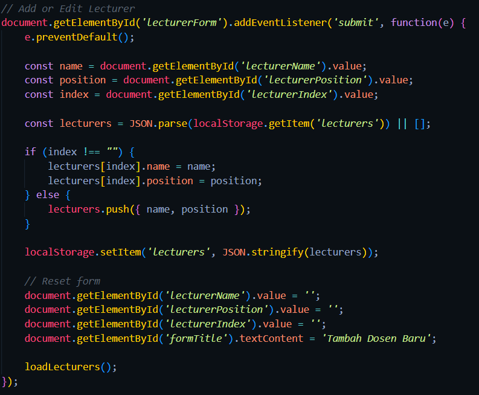

# Sistem Informasi Mahasiswa

Proyek ini adalah aplikasi sederhana berbasis PHP untuk mengelola data mahasiswa dan dosen menggunakan MySQL sebagai basis data. Proyek ini mencakup berbagai fitur mulai dari manipulasi DOM hingga pengelolaan state menggunakan session, cookie, dan local storage.

---

## **Fitur**

### **1. Manipulasi DOM**
Manipulasi DOM diimplementasikan pada bagian form, termasuk penambahan elemen secara dinamis dan validasi awal pada sisi klien.

---

### **2. Event Handling**
Event handling digunakan untuk validasi form, memastikan data yang dimasukkan oleh pengguna memenuhi kriteria sebelum dikirim ke server.

---

### **3. Pengelolaan Data dengan PHP**
Pengelolaan data dilakukan dengan menggunakan method `POST` untuk mengirim data dari form mahasiswa ke server. Data ini kemudian diproses dan disimpan dalam database.

---

### **4. OOP (Object-Oriented Programming)**
OOP diterapkan dalam pengelolaan cookie dan database. Kelas khusus digunakan untuk menangani penyimpanan cookie dan manipulasi data di database.

---

### **5. Pembuatan Tabel Database**
Tabel untuk mahasiswa dan dosen dibuat menggunakan query SQL yang ditulis dalam file `database.sql`. Proses ini melibatkan pembuatan struktur tabel lengkap dengan kolom-kolomnya.

---

### **6. Konfigurasi Koneksi**
Konfigurasi koneksi database dilakukan di file `connect.php`, yang mencakup parameter host, username, password, dan nama database.

---

### **7. Manipulasi Data pada Database**
Operasi CRUD (Create, Read, Update, Delete) dilakukan pada tabel mahasiswa dan dosen menggunakan query SQL yang didefinisikan di file `database.sql`.

---

### **8. State Management**
State management dengan `session_start()` digunakan untuk menyimpan data sementara selama sesi pengguna berlangsung.

---

### **9. Cookie Management**
Cookie digunakan untuk menyimpan informasi yang dikirimkan dari server ke browser. Implementasi ini berguna untuk menyimpan preferensi pengguna atau data lainnya.

---

### **10. Storage Management**
Storage management menggunakan Local Storage untuk menyimpan data dosen di browser secara permanen, bahkan setelah halaman di-refresh.

---

# README: Hosting Aplikasi Web dengan InfinityFree

## 1. Langkah-Langkah untuk Meng-host Aplikasi Web
Berikut adalah langkah-langkah yang dilakukan untuk meng-host aplikasi web menggunakan InfinityFree:  
1. **Mendaftar dan Login ke InfinityFree**  
   - Kunjungi [InfinityFree.net](https://infinityfree.net) dan buat akun baru atau login jika sudah memiliki akun.  

2. **Membuat Akun Hosting Baru**  
   - Klik **Create Account** di dashboard InfinityFree.  
   - Pilih subdomain gratis yang tersedia atau gunakan domain Anda sendiri.  

3. **Mengunggah File Aplikasi Web**  
   - Akses **File Manager** atau gunakan FTP client (seperti FileZilla) menggunakan kredensial FTP dari InfinityFree.  
   - Unggah file aplikasi web ke direktori `htdocs`.  

4. **Mengatur Database (Jika Diperlukan)**  
   - Jika aplikasi menggunakan database, buat database melalui menu **MySQL Databases** di cPanel.  
   - Perbarui file konfigurasi aplikasi untuk mencocokkan kredensial database.  

5. **Mengakses Aplikasi Web**  
   - Setelah semua file diunggah, aplikasi dapat diakses melalui URL yang terhubung dengan akun hosting Anda.  

## 2. Penyedia Hosting Web yang Dipilih
Saya memilih **InfinityFree** sebagai penyedia hosting web karena:  
- **Gratis:** Tidak ada biaya langganan dengan fitur dasar yang memadai.  
- **Mendukung PHP dan MySQL:** Memenuhi kebutuhan aplikasi web berbasis backend.  
- **cPanel Gratis:** Mempermudah pengelolaan file dan database.  
- **Subdomain Gratis:** Berguna untuk pengembangan awal tanpa perlu membeli domain.  

## 3. Keamanan Aplikasi Web
Untuk memastikan keamanan aplikasi web yang di-host:  
1. **Menggunakan HTTPS**  
   - InfinityFree menyediakan sertifikat SSL gratis untuk domain/subdomain, memastikan komunikasi aman antara server dan klien.  

2. **Validasi Input**  
   - Memastikan input dari pengguna divalidasi di sisi server untuk mencegah serangan seperti SQL Injection dan XSS.  

3. **Membatasi Izin File dan Direktori**  
   - Memberikan izin yang tepat pada file dan direktori untuk menghindari akses tidak sah.  

4. **Update Rutin**  
   - Melakukan pembaruan pada aplikasi web dan dependensi untuk mencegah kerentanan keamanan.  

## 4. Konfigurasi Server
Berikut adalah konfigurasi server yang diterapkan:  
- **PHP Versi Terbaru**  
  Menggunakan versi PHP terbaru yang tersedia pada InfinityFree untuk memanfaatkan fitur keamanan terkini.  
- **MySQL Database**  
  Database MySQL digunakan untuk menyimpan data aplikasi dengan kredensial aman.  
- **File Upload**  
  File diunggah melalui FTP ke direktori `htdocs`.  
- **SSL Configuration**  
  Mengaktifkan SSL gratis untuk mengenkripsi komunikasi.  

---

Dengan langkah-langkah ini, aplikasi web dapat berjalan optimal dan aman di InfinityFree.

